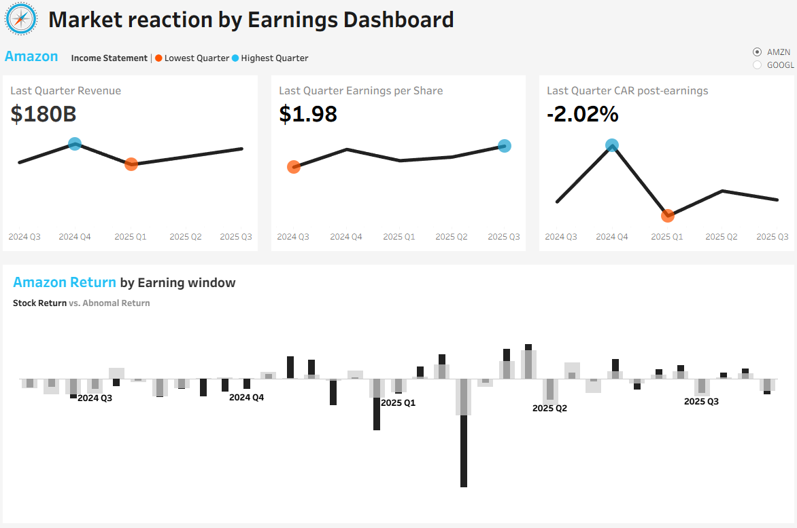

# 📊 Earnings Impact on Stock Prices — Event Study Analysis

## 📌 Problem Statement

Financial markets often react strongly to quarterly earnings announcements, but the magnitude and consistency of these reactions are not always clear.
This project analyzes how **Amazon (AMZN)** and **Google (GOOGL)** stock prices respond to earnings releases using a **trading-day event study approach**.

---

## 🧠 Project Objective

* Quantify stock price reactions around earnings announcements
* Isolate company-specific performance from overall market movements
* Compare earnings impacts across companies and quarters

---

## 🔄 Project Pipeline

```
Financial Modeling Prep API
          │
          ▼
     Python (Data Extraction)
          │
          ▼
   Raw CSV Files (Staging)
          │
          ▼
   SQL Server (SSMS)
   - Data Modeling
   - Fact & Dimension Tables
   - Event Window Logic
   - Abnormal Return Calculations
          │
          ▼
   Final Analysis View (CSV Export)
          │
          ▼
     Tableau Public Dashboard
```

---

## 🗂️ Project Structure

```
API_Finance_Project/
│
├── data/
│   ├── data_raw/
│   ├── data_cleaned/
│
├── SQL_data_transformaion/
│   ├── database/
│   ├── views/
│
├── notebook/
│   ├── API_raw_data.ipynb
│
├── dashboard/
│   ├── Market Reaction Dashboard.twbx
│
├── images/
│   ├── dashboard.png
│
└── README.md
```

---

## 🛠️ Skills Demonstrated

* Python (API data extraction, data cleaning)
* SQL Server (data modeling, window functions, event study logic)
* Financial analysis (returns, abnormal returns, CAR)
* Data warehousing (staging → fact/dimension design)
* Tableau (interactive dashboards, calculated fields)
* End-to-end analytics pipeline design

---

## 📊 Dashboard Preview



🔗 **Live Tableau Dashboard:**
[*(Go to Tableau Public)*](https://public.tableau.com/app/profile/huy.hoang.nguyen5826/viz/MarketReactionDashboard/Dashboard1)

---

## 🔍 Key Insights

* Earnings announcements are associated with **abnormal returns** around the event window
* Post-earnings reactions are stronger than pre-earnings movements
* Market-adjusted returns reveal clearer company-specific effects
* Reaction patterns differ between Amazon and Google across quarters

---

## 📁 Data Sources

* **Financial Modeling Prep API**

  * Quarterly earnings data
  * Daily stock prices
  * Market index prices

---

## 📌 Notes

* Event windows are based on **trading days (−3 to +3)**, not calendar days
* All heavy calculations are handled in SQL to keep Tableau lightweight and performant

---

⭐ **If you like this project, feel free to give it a star!**
It helps others discover the work and supports continuous improvement.

---
